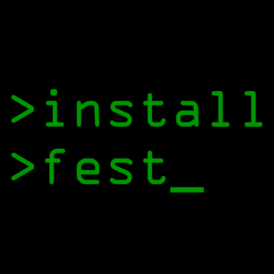

# Installfest Tasks



A collection of supporting (rake) tasks for Installfest.

Students should be able to download (or `curl`) and run this independently.

[](https://gemnasium.com/ga-dc/installfest)


## Managing Student Instructions

Instructions are provided to students via the [Project's GitHub pages](http://ga-dc.github.io/installfest) (gh-pages branch).

Currently, we generate `index.html`, from the gh-pages' `readme.md`,  using 'grip' (`sudo easy_install pip; pip install grip`).

1. `$ git checkout gh-pages`
2. Make updates to `readme.md`
3. `$ grip readme.md --export index.html`
4. commit and push to `gh-pages`.


## For developers

- Help
  ```
  rake -T
  ```

- Generate instructions
  ```
  rake installfest:instructions > installfest.md
  ```

### Configuration

installfest.yml is a list of which packages are expected to be installed, in what order.  The list can contain any known package.

Generate a sample config via:

    rake installfest:generate_config_file

List all possible packages via:

    rake installfest:known


### Architecture:
All required functionality is in this single Rakefile;
the rake tasks, the supporting library code, and the tests.
This is by design; to make it easier to install and use, at the expense of readability.  As stated, students should be able to `curl` and run this independently.  

### Important methods
- Installfest#my_packages lists all packages of interest to you.
- Installfest#packages lists all known packages, with supporting info.
- Installfest#assert_* are the various assertion methods.
